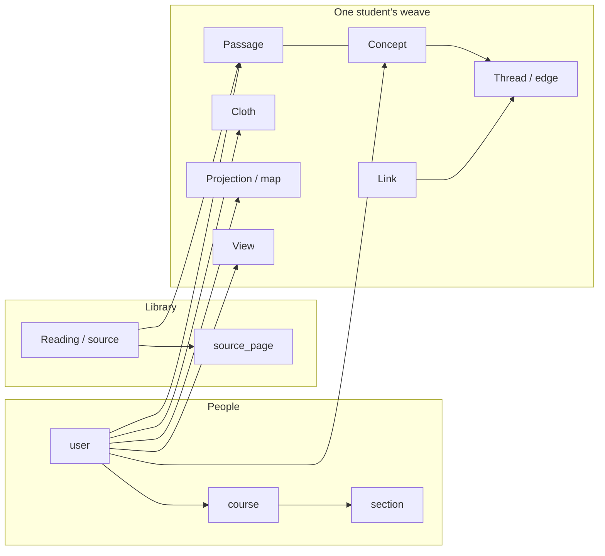

# Loom database, in English

Companion to [`schema.sql`](schema.sql). That file is the Postgres contract (run it, quote it, generate types from it). This file is the same database, written so a person can read it.

Same 26 public tables. Same columns, types, nullability, defaults, keys, and indexes. Built from the same dump (loom-demo through migration `0029_bitter_lockheed`). If this file and `schema.sql` ever disagree, **the SQL wins**.

Both apps share one live Postgres. This is not a copy of student rows. PDFs live in blob storage, not here — `source.storageKey` is only a key.

**Practical notes that bite:**

- Most columns are camelCase (`"userId"`, `"courseId"`). Unquoted `userid` is a different name.
- `"user"` and `"verificationToken"` must be quoted. `user` is a Postgres keyword.
- Row ids are text UUIDs minted in the app, not by Postgres.
- All timestamps are `timestamp without time zone`.
- Vocabularies like `role = FACULTY` or `tier = p` are strings. There are no enum types and no CHECK constraints.
- Some columns default to `''` and are still nullable. The old app usually writes `''`; a `NULL` is legal.

---

## The picture

A **course** has **sections** and a shared **library** of **readings**. A student is a **user** enrolled in a course (and maybe placed in a section). Their work lives on their own rows, scoped to that course.

From a reading they capture **passages**. They file passages under **concepts** (zero, one, or many). They connect concepts with **threads**. Each thread uses a **link** — a reusable relationship the student owns (“leads to”), plus a sentence that is true of this pair.

A **cloth** is their title and interpretation for a scope (one reading, or the whole weave). A **projection** (`map`) is one named sorting of their concepts. A **view** is display geometry — positions on a table — not part of the graph.



Table names in code are the July names (`source`, `edge`, `map`). The words in the UI are the model names above.

| UI / model | Table | Do not call it |
| --- | --- | --- |
| Reading | `source` | document, PDF row (the file is in blob storage) |
| Library | the set of `source` rows, joined to a course via `course_source` | |
| Passage | `passage` | highlight, snippet, quote, byte |
| Concept | `concept` | tag, topic, node, cluster |
| Link | `link` | edge type, relation name |
| Thread | `edge` | edge-as-meaning (meaning lives on `link` + `edge.sentence`) |
| Thread Description | `edge.sentence` | |
| Link Label | `link.label` (`edge.handle` is a leftover copy) | |
| Cloth | `cloth` | |
| Projection | `map` | |
| Projection Description | `map.read` | |
| Projection One-line | `map.essence` | |
| View | `view` | the graph itself |

`byte` in this database means file size (`source.byteLength`) or blob octets. It is never a Passage. The table used to be called `byte`; migration `0023` renamed it to `passage`.

---

## How the pieces join

```mermaid
erDiagram
  user ||--o{ course_membership : enrolled
  course ||--o{ course_membership : has
  course ||--o{ section : has
  section ||--o{ course_membership : placed
  course ||--o{ course_allowed_email : invites
  section ||--o{ course_allowed_email : preassigns
  section }o--o| user : lead

  course ||--o{ course_source : assigns
  source ||--o{ course_source : included
  source ||--o{ source_page : pages
  source ||--|| source_score : scored
  source ||--o{ source_repair : damage
  source_repair ||--o{ source_repair_reading : readers
  source ||--o{ source_revision : lineage
  user ||--o{ source : minted

  user ||--o{ passage : captures
  user ||--o{ concept : coins
  user ||--o{ link : owns
  user ||--o{ edge : throws
  user ||--o{ cloth : names
  user ||--o{ map : sorts
  user ||--o{ view : lays_out
  user ||--o{ graph_event : history

  source ||--o{ passage : from
  passage }o--o{ concept : passage_concept
  concept ||--o{ edge : from
  concept ||--o{ edge : to
  link ||--o{ edge : used_by
```

On almost every student table, `courseId` is nullable and `ON DELETE SET NULL`. Deleting a course does not delete the student's work; it orphans the `courseId`. Deleting the **user** cascades.

---

## 1. People and the door

### `user`

Someone who has signed in. Site-wide `role` lives here; per-course role lives on `course_membership`.

| Column | Type | Null | Default | Meaning |
| --- | --- | --- | --- | --- |
| `id` | text | no | — | PK. App UUID. |
| `name` | text | yes | — | Display name. |
| `email` | text | no | — | |
| `emailVerified` | timestamp | yes | — | |
| `image` | text | yes | — | Avatar URL. |
| `role` | text | no | `'USER'` | Site-wide. Old app also writes admin values here; not a constraint. |

### `account`

NextAuth OAuth account, tied to a user. Composite PK `(provider, providerAccountId)`.

| Column | Type | Null | Default | Meaning |
| --- | --- | --- | --- | --- |
| `userId` | text | no | — | → `user.id`, cascade. |
| `type` | text | no | — | NextAuth account type. |
| `provider` | text | no | — | e.g. `github`. |
| `providerAccountId` | text | no | — | |
| `refresh_token` | text | yes | — | |
| `access_token` | text | yes | — | |
| `expires_at` | integer | yes | — | |
| `token_type` | text | yes | — | |
| `scope` | text | yes | — | |
| `id_token` | text | yes | — | |
| `session_state` | text | yes | — | |

### `session`

NextAuth session. PK is `sessionToken`.

| Column | Type | Null | Default | Meaning |
| --- | --- | --- | --- | --- |
| `sessionToken` | text | no | — | PK. |
| `userId` | text | no | — | → `user.id`, cascade. |
| `expires` | timestamp | no | — | |

### `verificationToken`

NextAuth email magic-link tokens. Composite PK `(identifier, token)`.

| Column | Type | Null | Default | Meaning |
| --- | --- | --- | --- | --- |
| `identifier` | text | no | — | Usually the email. |
| `token` | text | no | — | |
| `expires` | timestamp | no | — | |

### `allowed_email`

Site-wide allowlist. PK is the email. Separate from per-course invitations (`course_allowed_email`).

| Column | Type | Null | Default | Meaning |
| --- | --- | --- | --- | --- |
| `email` | text | no | — | PK. |
| `createdAt` | timestamp | no | `now()` | |

### `auth_event`

Every sign-in decision, allow or refuse. Old app prunes rows older than 180 days in code (`pruneAuthEvents`); there is no database trigger.

| Column | Type | Null | Default | Meaning |
| --- | --- | --- | --- | --- |
| `id` | text | no | — | PK. App UUID. |
| `at` | timestamp | no | `now()` | Indexed (`auth_event_at_idx`). |
| `email` | text | no | — | Address the gate tested. Lowercased before insert. Empty on `no-verified-email`. Indexed (`auth_event_email_idx`). |
| `outcome` | text | no | — | Old app writes `allowed`, `not-on-roster`, `no-verified-email`. |
| `provider` | text | no | `''` | Old app writes `github` or `email`. |
| `handle` | text | no | `''` | Public name when there is no email to store. Empty otherwise. |

---

## 2. Courses

### `course`

A course offering. The library is attached here; quilting and cohort views scope to a section.

| Column | Type | Null | Default | Meaning |
| --- | --- | --- | --- | --- |
| `id` | text | no | — | PK. App UUID. |
| `slug` | text | no | — | Unique. |
| `name` | text | no | — | |
| `term` | text | no | `''` | Free-text run label, e.g. `Fall 2026`. |
| `description` | text | no | `''` | |
| `isArchived` | boolean | no | `false` | |
| `createdAt` | timestamp | no | `now()` | |

### `section`

One run-group inside a course (~14 students). Unique `(courseId, slug)`.

| Column | Type | Null | Default | Meaning |
| --- | --- | --- | --- | --- |
| `id` | text | no | — | PK. App UUID. |
| `courseId` | text | no | — | → `course.id`, cascade. |
| `slug` | text | no | — | Unique per course. |
| `name` | text | no | — | |
| `lead` | text | no | `''` | Legacy free-text “instructor of record”. Display fallback only. |
| `leadUserId` | text | yes | — | → `user.id`, set null. The actual lead; chosen from the course’s faculty. |
| `createdAt` | timestamp | no | `now()` | |

### `course_membership`

Enrolment. Composite PK `(courseId, userId)`. Soft-remove: the row stays so work and re-invite survive.

| Column | Type | Null | Default | Meaning |
| --- | --- | --- | --- | --- |
| `courseId` | text | no | — | → `course.id`, cascade. |
| `userId` | text | no | — | → `user.id`, cascade. |
| `sectionId` | text | yes | — | → `section.id`, set null. Null until placed. |
| `role` | text | no | `'LEARNER'` | Per-course. Old app writes `LEARNER` or `FACULTY`. Site-wide auth stays `user.role`. |
| `createdAt` | timestamp | no | `now()` | |
| `selectedAt` | timestamp | yes | — | Last time this membership was the working course. Null if they never switched. |
| `removedAt` | timestamp | yes | — | Set when an instructor removes them. Rosters treat the membership as ended; the row remains. |

### `course_allowed_email`

Per-course invitation roster. Composite PK `(courseId, email)`. On first sign-in the old app enrols from this table.

| Column | Type | Null | Default | Meaning |
| --- | --- | --- | --- | --- |
| `courseId` | text | no | — | → `course.id`, cascade. |
| `email` | text | no | — | |
| `sectionId` | text | yes | — | → `section.id`, set null. Optional pre-assignment. |
| `createdAt` | timestamp | no | `now()` | |

---

## 3. Library (readings)

The PDF is not in Postgres. `storageKey` locates it in blob storage. Canonical page text — the highlight-offset substrate — is in `source_page`.

### `source`

One reading. Course-agnostic: the same row can sit in many courses via `course_source`. A student can also mint a reading that has no `course_source` row (`isOwn`), so it never reaches anyone else.

| Column | Type | Null | Default | Meaning |
| --- | --- | --- | --- | --- |
| `id` | text | no | — | PK. App UUID. Never a slug. |
| `seedKey` | text | yes | — | Unique. Stable id for rows the seed script owns. Null for almost every row. |
| `title` | text | no | — | |
| `author` | text | yes | `''` | |
| `sourceReference` | text | yes | `''` | Citation. |
| `description` | text | yes | `''` | Blurb. |
| `isDescriptionVisible` | boolean | no | `true` | |
| `category` | text | no | `''` | Old app writes `''`, `history`, or `theory`. A fact of the reading, not of a course. |
| `metadataProvenance` | text | yes | `''` | |
| `isArchived` | boolean | no | `false` | Retired from the shared library. Courses that already include it keep the join. |
| `storageKey` | text | yes | — | Blob key. **Null** = reference-only: a card for something with no PDF here, so passages still have a door. |
| `byteLength` | integer | yes | — | File size in octets, for `Content-Length`. Null on old rows. Not a Passage. |
| `isOwn` | boolean | no | `false` | Student-added; shelf-only. |
| `createdByUserId` | text | yes | — | → `user.id`, set null. |
| `createdAt` | timestamp | no | `now()` | |

GIN index `source_search_idx`: title (A) + author (B) + citation and blurb (C). Search queries must use that exact `to_tsvector` expression.

### `course_source`

This reading, in this course. Composite PK `(courseId, sourceId)`. Visibility, week, and core/supplemental live here, not on `source`.

| Column | Type | Null | Default | Meaning |
| --- | --- | --- | --- | --- |
| `courseId` | text | no | — | → `course.id`, cascade. |
| `sourceId` | text | no | — | → `source.id`, cascade. |
| `isVisible` | boolean | no | `true` | Published to learners in this course. |
| `week` | integer | yes | — | Assigned week. Null = unscheduled. |
| `isCore` | boolean | no | `true` | Core vs supplemental. |
| `position` | integer | no | `0` | |
| `createdAt` | timestamp | no | `now()` | |

### `source_page`

One page of extracted text. Highlights are offsets into this string (or into a client text layer whose hash is stored on the passage).

| Column | Type | Null | Default | Meaning |
| --- | --- | --- | --- | --- |
| `id` | text | no | — | PK. App UUID. |
| `sourceId` | text | no | — | → `source.id`, cascade. |
| `pageNumber` | integer | no | — | |
| `textContent` | text | no | — | Canonical page text. |
| `contentHash` | text | no | — | Hash of the offset substrate, copied onto `passage.pageContentHash` at capture. |
| `width` | real | yes | — | Page size in PDF points. Document fact, not display zoom. Null on old rows. |
| `height` | real | yes | — | Same. |
| `createdAt` | timestamp | no | `now()` | |

Indexes: GIN `source_page_search_idx` on `to_tsvector('english', "textContent")`; btree `source_page_source_page_idx` on `("sourceId", "pageNumber")`.

### `source_score`

How well extraction survived, one row per reading. PK is `sourceId`.

| Column | Type | Null | Default | Meaning |
| --- | --- | --- | --- | --- |
| `sourceId` | text | no | — | PK. → `source.id`, cascade. |
| `status` | text | no | `'heuristic'` | Old app writes `heuristic`, `judged`, or `unscorable`. |
| `coverage` | integer | yes | — | |
| `legibility` | integer | yes | — | |
| `anchorability` | integer | yes | — | |
| `structure` | integer | yes | — | Judge-only. |
| `overall` | real | yes | — | Mean of whichever dimensions are non-null. |
| `pass` | boolean | yes | — | |
| `notes` | text | no | `''` | |
| `judgeNotes` | text | no | `''` | |
| `judgeModel` | text | yes | — | |
| `metrics` | jsonb | yes | — | Extraction metrics blob. |
| `scoredAt` | timestamp | no | `now()` | |

### `source_repair`

A damaged region and the proposal to repair it. A row is a proposal until `appliedAt` is set. Valid only for `measuredAgainstKey` — if the PDF rotates, old proposals no longer describe it.

| Column | Type | Null | Default | Meaning |
| --- | --- | --- | --- | --- |
| `id` | text | no | — | PK. App UUID. |
| `sourceId` | text | no | — | → `source.id`, cascade. |
| `pageNumber` | integer | no | — | |
| `measuredAgainstKey` | text | no | — | The `storageKey` this damage was measured against. |
| `region` | jsonb | no | — | Old app writes `{ x, y, width, height, scale }` in rendered pixels. |
| `cropKey` | text | no | — | Blob key of the crop an admin reviews. |
| `currentText` | text | no | `''` | What the PDF extracts here now. |
| `garbledWords` | jsonb | no | `[]` | Array of strings. |
| `garbleRate` | real | yes | — | |
| `status` | text | no | `'proposed'` | Old app writes `proposed`, `accepted`, `rejected`, `applied`. |
| `agreedText` | text | no | `''` | Text the readers agreed on, before human edit. |
| `disagreements` | jsonb | no | `[]` | Old app writes `{ passage, readings[] }[]`. |
| `votes` | jsonb | yes | — | Panel stats (readers, majority, per-reader agreement). |
| `acceptedText` | text | yes | — | What the admin approved. |
| `acceptedByUserId` | text | yes | — | → `user.id`, set null. |
| `acceptedAt` | timestamp | yes | — | |
| `reviewNote` | text | no | `''` | Why, on reject or override. |
| `appliedAt` | timestamp | yes | — | Written into a new revision of the reading. |
| `createdAt` | timestamp | no | `now()` | |

Indexes: btree on `sourceId`, btree on `status`.

### `source_repair_reading`

One model’s independent reading of a damaged region. Kept per reader so agreement is visible.

| Column | Type | Null | Default | Meaning |
| --- | --- | --- | --- | --- |
| `id` | text | no | — | PK. App UUID. |
| `repairId` | text | no | — | → `source_repair.id`, cascade. |
| `model` | text | no | — | |
| `reader` | integer | no | — | 1-based which independent reader. |
| `text` | text | no | `''` | |
| `uncertain` | jsonb | no | `[]` | Passages the reader flagged as unsure. |
| `illegibleShare` | text | yes | — | Old app writes `none`, `some`, `much`, `most`. |
| `promptTokens` | integer | yes | — | As the API reported. Null ≠ free. |
| `completionTokens` | integer | yes | — | |
| `costUsd` | real | yes | — | |
| `durationMs` | integer | yes | — | |
| `truncated` | boolean | no | `false` | Ran out of room; excluded from the vote. |
| `createdAt` | timestamp | no | `now()` | |

Index: btree on `repairId`.

### `source_revision`

One rotation of the stored file. Append-only by convention. Walk this to find prior `storageKey`s.

| Column | Type | Null | Default | Meaning |
| --- | --- | --- | --- | --- |
| `id` | text | no | — | PK. App UUID. |
| `sourceId` | text | no | — | → `source.id`, cascade. |
| `storageKey` | text | no | — | The key this revision made current. |
| `predecessorKey` | text | yes | — | The key it superseded. |
| `reason` | text | no | `''` | Why, in a sentence. |
| `createdAt` | timestamp | no | `now()` | |

Index: btree on `sourceId`.

---

## 4. The weave (one student’s work)

These rows are owned by `userId`. `courseId` is the working course, nullable.

### `passage`

One captured excerpt. A passage with **zero** `passage_concept` rows is an unlabeled passage — a legal first-class state. Deleting a concept never deletes the passage.

| Column | Type | Null | Default | Meaning |
| --- | --- | --- | --- | --- |
| `id` | text | no | — | PK. App UUID. |
| `courseId` | text | yes | — | → `course.id`, set null. |
| `userId` | text | no | — | → `user.id`, cascade. |
| `source` | text | yes | `''` | Free-text label for captures not tied to a library PDF. |
| `sourceId` | text | yes | — | → `source.id`, **set null**. The passage outlives a deleted reading. |
| `location` | text | yes | `''` | |
| `content` | text | no | — | The excerpt. |
| `pageNumber` | integer | yes | — | |
| `startOffset` | integer | yes | — | |
| `endOffset` | integer | yes | — | |
| `pageContentHash` | text | yes | — | Hash of the page text these offsets were computed against. |
| `note` | text | no | `''` | Student’s margin. |
| `question` | text | no | `''` | |
| `isPullQuote` | boolean | no | `false` | |
| `tier` | text | no | `''` | Passage tier: old app writes `''`, `p`, `s`, or `t`. Not the per-projection concept tiers. |
| `createdAt` | timestamp | no | `now()` | |

Indexes: GIN `passage_search_idx` (content B, note/question C); btree `passage_sourceId_idx`.

### `passage_concept`

Which concepts a passage evidences. Composite PK `(passageId, conceptId)`. Cascade both ways — losing either end removes the pointer, never the other object.

| Column | Type | Null | Default | Meaning |
| --- | --- | --- | --- | --- |
| `passageId` | text | no | — | → `passage.id`, cascade. |
| `conceptId` | text | no | — | → `concept.id`, cascade. |
| `createdAt` | timestamp | no | `now()` | |

Index: btree on `conceptId`.

### `concept`

A grouping of passages. Homonyms are allowed (no unique on `label`).

| Column | Type | Null | Default | Meaning |
| --- | --- | --- | --- | --- |
| `id` | text | no | — | PK. App UUID. |
| `courseId` | text | yes | — | → `course.id`, set null. |
| `userId` | text | no | — | → `user.id`, cascade. |
| `label` | text | no | — | |
| `def` | text | yes | `''` | Gloss. |
| `note` | text | yes | `''` | |
| `createdAt` | timestamp | no | `now()` | |

There is **no** `tier` column. Concept tiers live per projection in `map.tiers`.

GIN index `concept_search_idx`: label (A) + gloss (B) + note (C).

### `link`

A reusable relationship the student owns (label + gloss). User-level, like a concept. Exists before any thread uses it. No unique on `label` — homonyms are warned, not forbidden.

| Column | Type | Null | Default | Meaning |
| --- | --- | --- | --- | --- |
| `id` | text | no | — | PK. App UUID. |
| `courseId` | text | yes | — | → `course.id`, set null. |
| `userId` | text | no | — | → `user.id`, cascade. |
| `label` | text | no | `''` | The Link Label. |
| `description` | text | no | `''` | One meaning, shared by every thread that uses this link. |
| `createdAt` | timestamp | no | `now()` | |

Indexes: btree `link_user_course_idx` on `("userId", "courseId")`; GIN `link_search_idx` on label (A) + description (B).

### `edge` (Thread)

One thread between two concepts. The Link is `linkId`; the per-pair sentence is `sentence`.

| Column | Type | Null | Default | Meaning |
| --- | --- | --- | --- | --- |
| `id` | text | no | — | PK. App UUID. |
| `courseId` | text | yes | — | → `course.id`, set null. |
| `userId` | text | no | — | → `user.id`, cascade. |
| `fromId` | text | no | — | → `concept.id`, cascade. |
| `toId` | text | no | — | → `concept.id`, cascade. |
| `handle` | text | yes | `''` | **Legacy.** Dual-written copy of the Link Label. Still written and still read as a fallback. |
| `linkId` | text | yes | — | → `link.id`, set null. Null = thrown but not yet labelled. |
| `sentence` | text | no | `''` | Thread Description. Optional at throw. |
| `createdAt` | timestamp | no | `now()` | |

GIN index `edge_search_idx` on handle (A) + sentence (B).

### `cloth`

The student’s title and interpretation for a scope. `scopeKey = ''` is the whole weave; otherwise it is the sorted comma-joined `sourceId`s of that scope.

Unique on `("userId", "courseId", "scopeKey")` with **`NULLS NOT DISTINCT`**, so the pre-course row (`courseId` null) is unique too.

| Column | Type | Null | Default | Meaning |
| --- | --- | --- | --- | --- |
| `id` | text | no | — | PK. App UUID. |
| `courseId` | text | yes | — | → `course.id`, set null. |
| `userId` | text | no | — | → `user.id`, cascade. |
| `scopeKey` | text | no | `''` | `''` = whole weave. |
| `title` | text | no | `''` | |
| `description` | text | no | `''` | |
| `createdAt` | timestamp | no | `now()` | |
| `updatedAt` | timestamp | no | `now()` | |

### `map` (Projection)

One named sorting of the student’s concepts for a scope. Several maps per scope is the point — there is **no** unique constraint, only an index.

| Column | Type | Null | Default | Meaning |
| --- | --- | --- | --- | --- |
| `id` | text | no | — | PK. App UUID. |
| `courseId` | text | yes | — | → `course.id`, set null. |
| `userId` | text | no | — | → `user.id`, cascade. |
| `scopeKey` | text | no | `''` | Same convention as cloth. |
| `name` | text | no | — | |
| `read` | text | no | `''` | Projection Description. |
| `essence` | text | no | `''` | Projection One-line. |
| `tiers` | jsonb | no | `{}` | Old app writes `{ [conceptId]: "p" \| "s" \| "t" \| "x" }`. Absent key = unsorted. |
| `createdAt` | timestamp | no | `now()` | |
| `updatedAt` | timestamp | no | `now()` | |

Index: btree `map_user_course_scope_idx` on `("userId", "courseId", "scopeKey")`.

Card-table geometry for map `<id>` lives in `view` under key `map:<id>`, not on this row.

### `view`

Student-authored display geometry. Not part of the graph. Unique on `("userId", "courseId", "key")` with **`NULLS NOT DISTINCT`**.

| Column | Type | Null | Default | Meaning |
| --- | --- | --- | --- | --- |
| `id` | text | no | — | PK. App UUID. |
| `courseId` | text | yes | — | → `course.id`, set null. |
| `userId` | text | no | — | → `user.id`, cascade. |
| `key` | text | no | — | Old app: `cardTable` first; `map:<id>` for a projection. |
| `data` | jsonb | no | — | Old app: `{ positions: { conceptId: {x,y} }, bends: { edgeId: {dx,dy} } }`. |
| `updatedAt` | timestamp | no | `now()` | |

### `graph_event`

Append-only record of the student’s own graph acts. Survives a reset of the cloth. Best-effort writes — the graph tables are the source of truth.

| Column | Type | Null | Default | Meaning |
| --- | --- | --- | --- | --- |
| `id` | text | no | — | PK. App UUID. |
| `courseId` | text | yes | — | → `course.id`, set null. |
| `userId` | text | no | — | → `user.id`, cascade. |
| `kind` | text | no | — | `'<entity>.<act>'`, e.g. `concept.create`, `passage.capture`, `edge.coin`, `graph.reset`. |
| `entityType` | text | no | — | Old app writes `concept`, `passage`, `edge`, `link`, `graph`, `map`, `cloth`, `reading`. |
| `entityId` | text | yes | — | |
| `payload` | jsonb | yes | — | Enough to replay the graph at that point. |
| `at` | timestamp | no | `now()` | |

---

## 5. Old Loom’s migration ledger

### `drizzle.__drizzle_migrations`

Which Drizzle migrations the old app has applied. The new app should **read this only if it must know how far production has come**. Do not insert rows. Do not run Drizzle migrate against the shared database from the new repo.

| Column | Type | Null | Default | Meaning |
| --- | --- | --- | --- | --- |
| `id` | integer | no | serial | PK. |
| `hash` | text | no | — | Migration hash. |
| `created_at` | bigint | yes | — | |

---

## Indexes that exist even though the TypeScript schema stopped listing them

These are on a fully-migrated database (see `schema.sql`). Use them; they are real.

| Index | On |
| --- | --- |
| `passage_sourceId_idx` | `passage("sourceId")` |
| `source_page_source_page_idx` | `source_page("sourceId", "pageNumber")` |
| `source_repair_sourceId_idx` | `source_repair("sourceId")` |
| `source_repair_status_idx` | `source_repair(status)` |
| `source_repair_reading_repairId_idx` | `source_repair_reading("repairId")` |

---

## What is not in this database

- PDF bytes — blob store, keyed by `source.storageKey` / `source_repair.cropKey` / `source_revision.storageKey`
- Enum types, views, triggers, or stored functions
- A `read` table (absorbed into `cloth` in migration `0021`)
- A `byte` table (renamed to `passage` in migration `0023`)
